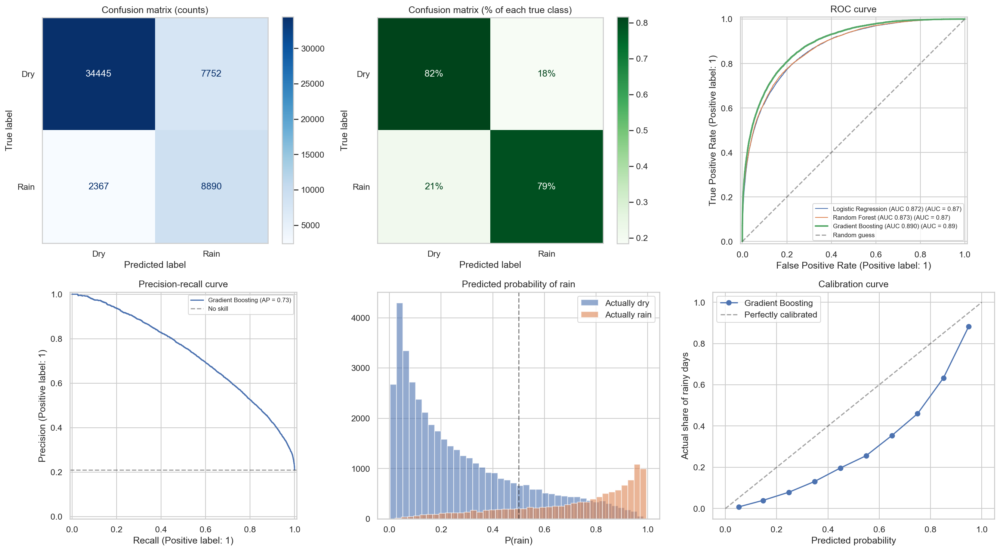
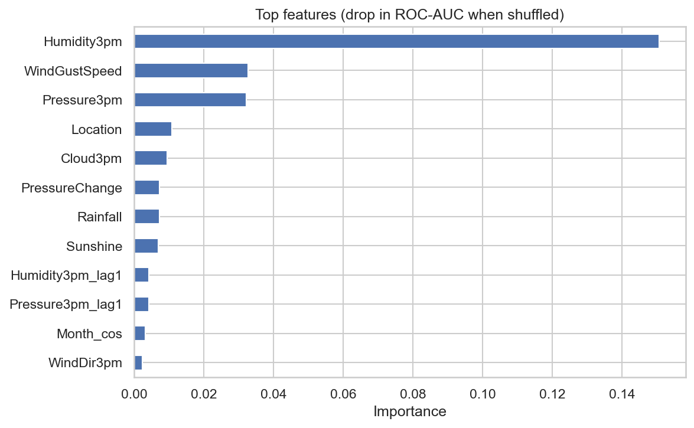

# 🌧️ Rainfall Prediction: Will It Rain Tomorrow?


A machine learning project that predicts whether it will rain tomorrow from today's weather observations. It uses the Rain in Australia (weatherAUS) dataset and covers the full workflow: data exploration, feature engineering, a leak-free time-based split, model comparison, threshold tuning, and model explanation.

**Author:** Soni Kumari Sah ([@Sonisah-013](https://github.com/Sonisah-013))

---

## Table of contents
- [Project at a glance](#project-at-a-glance)
- [Highlights](#highlights)
- [Problem](#problem)
- [Dataset](#dataset)
- [Workflow](#workflow)
- [Feature engineering](#feature-engineering)
- [Models](#models)
- [Metrics explained](#metrics-explained)
- [Results](#results)
- [Using the saved model](#using-the-saved-model)
- [Project structure](#project-structure)
- [Getting started](#getting-started)
- [FAQ](#faq)
- [Limitations](#limitations)
- [Roadmap](#roadmap)
- [Related research](#related-research)
- [Acknowledgements](#acknowledgements)

---

## Project at a glance

| | |
|---|---|
| **Task** | Binary classification: rain tomorrow, yes or no |
| **Data** | Rain in Australia (weatherAUS), daily station observations |
| **Training set** | 213,863 rows (2007-11 to 2022-11), 22.3% rainy |
| **Test set** | 53,454 rows (2022-11 to 2026-01), 21.1% rainy |
| **Validation** | Chronological split, so the model never sees the future |
| **Models** | Baseline, Logistic Regression, Random Forest, Gradient Boosting |
| **Main metrics** | Recall, F1, ROC-AUC, PR-AUC |
| **Tools** | Python, pandas, NumPy, scikit-learn, Matplotlib, Seaborn |

## Highlights
- **Time-based split:** trains on the past and tests on the future, so the model never sees the days it is graded on.
- **Imbalance-aware evaluation:** only about 1 in 5 days is rainy, so models are judged on recall, F1, ROC-AUC and PR-AUC, not on accuracy alone.
- **Engineered features:** lag and rolling-window features computed per location from past and present data only.
- **Leakage handled:** the `RISK_MM` column, which contains tomorrow's rainfall, is removed.
- **Honest threshold tuning:** the decision threshold is chosen on a validation slice, not on the test set.
- **Explainable:** permutation feature importance, calibration curve, and error analysis charts.

## Problem
Given today's weather at a station (temperature, humidity, pressure, wind, cloud cover, rainfall), predict whether tomorrow will have rain.

| | |
|---|---|
| **Target** | `RainTomorrow` (1 = 1 mm or more of rain the next day, 0 = otherwise) |
| **Task** | Binary classification |
| **Main challenge** | Class imbalance: about 21% of test days are rainy |

A model that always predicts "dry" is right on roughly 79% of test days but never catches a single rainy day. That is why it is used here only as a **baseline** to beat.

## Dataset
- **Rain in Australia (weatherAUS):** daily observations from many weather stations across Australia.
- Source: [Kaggle](https://www.kaggle.com/jsphyg/weather-dataset-rattle-package)
- The notebook loads the CSV directly from `https://rattle.togaware.com/weatherAUS.csv`. A local copy can be kept in `data/` (not committed to Git).

**Data quality notes**
- About 22% of days are rainy, so the classes are imbalanced.
- Sunshine, Evaporation, Cloud9am and Cloud3pm are missing in roughly 45% to 62% of rows and are imputed with the median.
- About 3% of rows have no `RainTomorrow` value and are dropped.
- Rain is somewhat more frequent from June to August across all stations combined.

## Workflow
1. **Explore:** missing values, class balance, rainy days by month.
2. **Clean:** drop the leaky `RISK_MM` column (if present) and rows with no target; encode the target as 0/1.
3. **Engineer features:** see below.
4. **Analyse features:** distributions (dry vs rainy), outliers, correlation heatmap, near-duplicate features.
5. **Split by time:** oldest 80% for training, newest 20% for testing.
6. **Preprocess:** median imputation and scaling for numeric columns; most-frequent imputation and one-hot encoding for categorical columns.
7. **Train and compare** four models.
8. **Evaluate** the best model with confusion matrices, ROC and precision-recall curves, a probability histogram and a calibration curve.
9. **Tune the threshold** on a validation slice from the end of the training period.
10. **Explain** the model with permutation feature importance.
11. **Save** the model and threshold with `joblib`.

## Feature engineering
All lag and rolling features are computed **per location** and use only past and present data, so nothing from the future leaks in.

| Feature | Meaning |
|---|---|
| `TempRange` | Max temperature minus min temperature |
| `PressureChange` | 3pm pressure minus 9am pressure |
| `HumidityChange` | 3pm humidity minus 9am humidity |
| `TempChange` | 3pm temperature minus 9am temperature |
| `Rainfall_lag1` | Yesterday's rainfall |
| `Humidity3pm_lag1`, `Pressure3pm_lag1` | Yesterday's 3pm humidity and pressure |
| `Rainfall_3day`, `Rainfall_7day` | Rolling rainfall totals |
| `Month_sin`, `Month_cos` | Month as a cycle, so December and January are neighbours |

## Models
| Model | Why it is included |
|---|---|
| Baseline (always dry) | Reference point every real model must beat |
| Logistic Regression | Simple, fast, interpretable |
| Random Forest | Many trees voting; robust and stable |
| Gradient Boosting (`HistGradientBoostingClassifier`) | Trees built one after another, correcting earlier mistakes; often the strongest on tabular data |

`class_weight="balanced"` is used so that mistakes on the rarer rainy class count more.

## Metrics explained

| Metric | Question it answers | Bad | Good |
|---|---|---|---|
| **Recall** | Of the days that really had rain, how many did the model catch? | 0 | close to 1 |
| **Precision** | When the model said rain, how often was it right? | low | close to 1 |
| **F1** | One number balancing precision and recall | 0 | close to 1 |
| **ROC-AUC** | How well does the model rank rainy days above dry days? | 0.5 | close to 1 |
| **PR-AUC** | The same ranking skill, focused on the rare rainy class | about 0.21 (the rainy share) | close to 1 |

Accuracy is reported too, but it is misleading here: the "always dry" baseline scores about 79% while catching no rain.

## Results

> Numbers come from running `notebooks/rainfall prediction.ipynb`.

| Model | Accuracy | Precision | Recall | F1 | ROC-AUC | PR-AUC |
|---|---|---|---|---|---|---|
| Baseline (always dry) | | | | | | |
| Logistic Regression | | | | | | |
| Random Forest | | | | | | |
| Gradient Boosting | | | | | | |

**Best model:** _(name)_

**Threshold tuning** (chosen on validation data, evaluated on the test set):

| Threshold | Precision | Recall | F1 |
|---|---|---|---|
| Default 0.50 | | | |
| Tuned _(value)_ | | | |

**Key findings**
- _(How much the best model beats the baseline on recall and F1.)_
- _(Top features from the importance chart.)_
- _(Anything surprising in the correlation or distribution charts.)_

### Charts




## Using the saved model
The notebook saves the best pipeline, its tuned threshold, and the feature list to `models/rain_model.joblib`.

```python
import joblib

bundle = joblib.load("models/rain_model.joblib")
model, threshold, features = bundle["model"], bundle["threshold"], bundle["features"]

# X_new must be a pandas DataFrame containing the engineered feature columns
proba = model.predict_proba(X_new[features])[:, 1]
will_rain = (proba >= threshold).astype(int)
```

The model expects the same engineered columns used in training, so new data must go through the feature engineering step first.

## Project structure
```
rainfall-prediction/
├── data/                              # local copy of weatherAUS.csv (not committed)
├── images/                            # saved charts
├── models/                            # saved model (not committed)
├── notebooks/
│   └── rainfall prediction.ipynb      # full analysis, run top to bottom
├── src/                               # scripts (optional)
├── requirements.txt
├── .gitignore
└── README.md
```

## Getting started

**1. Clone the repository**
```powershell
git clone https://github.com/Sonisah-013/rainfall-prediction.git
cd rainfall-prediction
```

**2. Create a virtual environment and install the packages**
```powershell
python -m venv venv
.\venv\Scripts\activate
.\venv\Scripts\python.exe -m pip install -r requirements.txt
```
On macOS or Linux, use `source venv/bin/activate` and `pip install -r requirements.txt`.

**3. Run the notebook**
1. Open `notebooks/rainfall prediction.ipynb` in VS Code (or Jupyter).
2. Select the `venv` Python as the kernel.
3. Click **Restart**, then **Run All**. Random Forest takes a few minutes to train.

Charts are saved to `images/` and the trained model to `models/`. The random seed is fixed (`42`), so results are reproducible.

**requirements.txt**
```
pandas
numpy
matplotlib
seaborn
scikit-learn
joblib
requests
ipykernel
```

## FAQ

**Why a time-based split instead of a random one?**
A random split lets the model train on days that sit between test days, which leaks information. Training on the past and testing on the future matches how a real forecast is used.

**Why not just report accuracy?**
About 79% of test days are dry, so a model that always says "no rain" already gets about 79% accuracy while catching no rain at all. Recall, F1 and PR-AUC show whether the model finds the rainy days.

**Why is the threshold tuned on validation data?**
Tuning it on the test set would make the test results look better than they really are. A validation slice from the end of the training period keeps the test set untouched.

**Why do the Sunshine and Evaporation columns matter?**
They are missing in more than half of rows. Imputed values carry little real information, so a useful experiment is to drop those columns and compare results.

## Limitations
- The data is Australian, so the model should not be applied to other climates without retraining.
- Several columns (Sunshine, Evaporation, Cloud) have many missing values that are imputed.
- Features come from daily station observations; this is not a physics-based forecast.
- Results depend on the time period used for testing.
- Missing dates within a station are not filled, so lag features are approximate where records have gaps.

## Roadmap
- [ ] Add XGBoost or LightGBM to the comparison
- [ ] Compare results with and without the high-missing columns
- [ ] Retrain on Nepal weather data (for example from the [Open-Meteo](https://open-meteo.com) historical API, credited under CC BY 4.0) and compare with the Australian results
- [ ] Build a Streamlit app that loads the saved model and shows a prediction
- [ ] Add a live demo that feeds current weather into the model
- [ ] Add a LICENSE file

## Related research
- Oswal, N. *Predicting Rainfall using Machine Learning Techniques.* arXiv:1910.13827. https://arxiv.org/abs/1910.13827
- Sarasa-Cabezuelo, A. *Prediction of Rainfall in Australia Using Machine Learning.* Information, 2022. https://doi.org/10.3390/info13040163
- Sharma, D., Shukla, A. K., Rattan, P. *Machine learning techniques for rainfall prediction: a systematic literature review.* IAES International Journal of Artificial Intelligence. https://ijai.iaescore.com/index.php/IJAI/article/view/27021
- Poudyal, S., Katwal, S., Shakya, R. *Rainfall Prediction in Kathmandu City Using Machine Learning and Deep Learning Techniques.* https://www.nepjol.info/index.php/injetindev/article/view/95697
- Cramer, S., Kampouridis, M., Freitas, A. A., Alexandridis, A. K. *An extensive evaluation of seven machine learning methods for rainfall prediction in weather derivatives.* Expert Systems with Applications, 2017. https://doi.org/10.1016/j.eswa.2017.05.029

## Acknowledgements
- Dataset: Rain in Australia (weatherAUS), via Kaggle.
- Libraries: pandas, NumPy, scikit-learn, Matplotlib, Seaborn, joblib.
